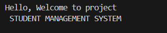
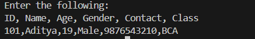
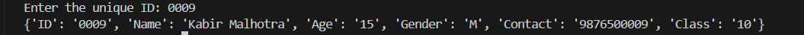

# 🎓 Student Management System

A Python-based Student Management System that allows users to manage student records using CSV files.

---

## ✨ Features

✅ Add students  
✅ Search students  
✅ Update student information  
✅ Delete records  
✅ Store data in CSV format

---

## 💻 Technologies Used

✅ Python  
✅ CSV Module

---

## 🚀 How to Run

```bash
git clone https://github.com/adityaaggarwal1011/Student-Management-System.git

cd Student-Management-System

python main.py
```

---

## 📂 Project Structure

```
Student-Management-System/
│
├── main.py
├── students.csv
├── README.md
└── screenshots/
```
---

## 📸 Preview

### 🏠 Home Screen



Displays the welcome message of the Student Management System.

---

### ➕ Add Student



Adds a new student record to the CSV file.

---

### 🔍 Find Student by ID



Searches and displays a student's information using their unique ID.

---

---
## 👨‍💻 Author

Aditya Aggarwal
---
